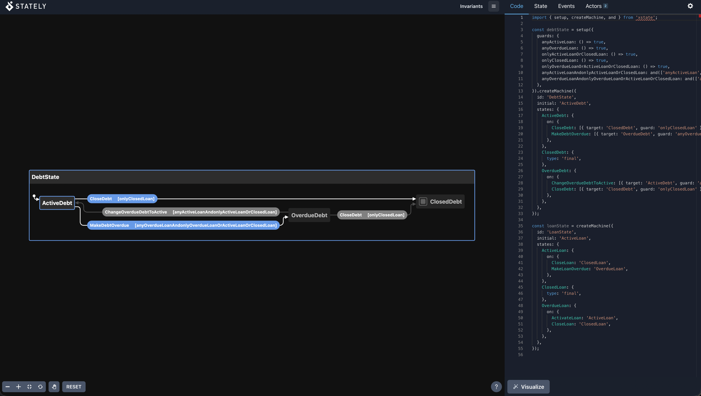

# invariants

[](https://pypi.org/project/invariants/)
[](https://pypi.org/project/invariants/)
[](https://github.com/nkhitrov/invariants/blob/main/LICENSE)

Type-safe state modeling for Python. Split entity invariants into separate, validated, immutable state classes using Pydantic.

## Why?

When an entity has multiple states, each state often has different field requirements. Typically, this is modeled with optional fields and runtime checks. **invariants** enforces these constraints at the type level:

- Each state is a separate class with its own field types
- A metaclass ensures child states override all abstract fields and don't add new ones
- All states are immutable
- `StateMachine` defines valid transitions with type-safe signatures

## Installation

```bash
pip install invariants
```

## Quick Start

Define a root state with `Statefull` fields (abstract markers), then create concrete states that override them:

```python
from datetime import datetime
from typing import Literal

from invariants.state import State, Statefull, StateMachine


class LoanState(State):
    id: int
    status: Statefull
    postponement_date: Statefull


class ActiveLoan(LoanState):
    status: Literal["active"] = "active"
    postponement_date: datetime


class ClosedLoan(LoanState):
    status: Literal["closed"] = "closed"
    postponement_date: None = None


class OverdueLoan(LoanState):
    status: Literal["overdue"] = "overdue"
    postponement_date: datetime
```

The metaclass enforces two rules at class creation time:
1. Child states **cannot add new fields** — only override parent fields
2. Child states **must override all `Statefull` fields** with concrete types

Define state transitions with `StateMachine`:

```python
class CloseLoan(StateMachine[LoanState]):
    def execute(self, loan: ActiveLoan | OverdueLoan) -> ClosedLoan:
        return ClosedLoan(id=loan.id)


class MakeLoanOverdue(StateMachine[LoanState]):
    def execute(self, loan: ActiveLoan) -> OverdueLoan:
        return OverdueLoan(id=loan.id, postponement_date=loan.postponement_date)
```

The `execute` method signature documents which transitions are valid — from which states to which.

## Nested States

States can contain other states. Use `ContainsOne` to validate that a collection includes at least one instance of a specific type:

```python
from typing import Annotated, Literal
from invariants.conditions import ContainsOne


class DebtState(State):
    status: Statefull
    loans: Statefull


class ActiveDebt(DebtState):
    status: Literal["active"] = "active"
    loans: Annotated[tuple[ActiveLoan | ClosedLoan, ...], ContainsOne(ActiveLoan)]


class ClosedDebt(DebtState):
    status: Literal["closed"] = "closed"
    loans: tuple[ClosedLoan, ...]


class OverdueDebt(DebtState):
    status: Literal["overdue"] = "overdue"
    loans: Annotated[
        tuple[OverdueLoan | ActiveLoan | ClosedLoan, ...], ContainsOne(OverdueLoan)
    ]
```

`ActiveDebt` guarantees at compile time that it only contains active or closed loans, and at runtime that at least one is active.

## Factories (Testing)

Optional integration with [polyfactory](https://github.com/litestar-org/polyfactory) for generating test data. The key idea: **a factory always produces a valid state** — all business invariants are satisfied automatically.

```bash
pip install invariants[factories]
```

Define factories for concrete states — the model is inferred from the generic argument:

```python
from invariants.factories import StateFactory


class ActiveLoanFactory(StateFactory[ActiveLoan]): ...
class ClosedLoanFactory(StateFactory[ClosedLoan]): ...
class ActiveDebtFactory(StateFactory[ActiveDebt]): ...
```

When you build a nested state, child entities are generated automatically:

```python
debt = ActiveDebtFactory.build()

# loans are auto-populated with valid ActiveLoan | ClosedLoan instances
# ContainsOne(ActiveLoan) is always satisfied — at least one loan is active
assert any(isinstance(loan, ActiveLoan) for loan in debt.loans)
```

### SQLAlchemy Integration

`SQLAlchemyStateFactory` maps Pydantic states to ORM models — `build()` returns ORM instances instead of Pydantic models:

```python
from invariants.factories.sqlalchemy import SQLAlchemyStateFactory


class ActiveLoanORMFactory(SQLAlchemyStateFactory[ActiveLoan, LoanORM]): ...

loan = ActiveLoanORMFactory.build()
assert isinstance(loan, LoanORM)  # ORM instance, not Pydantic model
```

Both `StateFactory` and `SQLAlchemyStateFactory` are thin wrappers over [polyfactory](https://polyfactory.litestar.dev/) — all interfaces (sessions, persistence, batch creation) work the same as in the polyfactory docs.

## XState Visualization

Generate [XState v5](https://stately.ai/docs/xstate) state machine code from your `StateMachine` subclasses:

```bash
# Print generated JS
python -m invariants.viz print examples.debt

# Start interactive visualizer
python -m invariants.viz serve examples.debt
```

And open visualisation in browser


